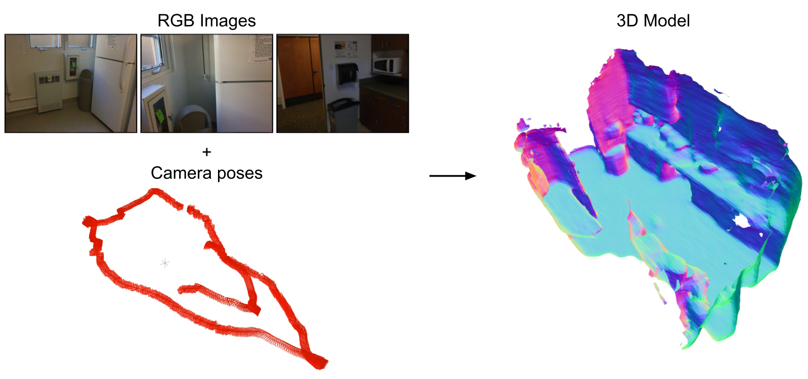

# VoRTX: Volumetric 3D Reconstruction With Transformers for Voxelwise View Selection and Fusion

## [Project Page](https://noahstier.github.io/vortx/) | [Paper](https://arxiv.org/abs/2112.00236) | [Weights](https://drive.google.com/file/d/1I4qJplvs95b3mOnaEfCvF1vhnyEqJ0f9/view)
| [ScanNet Test Results](https://drive.google.com/drive/folders/1s-i_6WiwJ9lsM48vxaTbzXsRLJfJXlrc?usp=sharing)

VoRTX is a deep learning model for 3D reconstruction from posed RGB images, using transformers for multi-view fusion.



## Setup

Tested on Ubunutu 20.04.

### Dependencies

```
conda create -n vortx python=3.9 -y
conda activate vortx

conda install pytorch torchvision cudatoolkit=11.3 -c pytorch

pip install \
  pytorch-lightning==1.5 \
  scikit-image==0.18 \
  numba \
  pillow \
  wandb \
  tqdm \
  open3d \
  pyrender \
  ray \
  trimesh \
  pyyaml \
  matplotlib \
  black \
  pycuda \
  opencv-python \
  imageio

sudo apt install libsparsehash-dev
pip install git+https://github.com/mit-han-lab/torchsparse.git@v1.4.0 

pip install -e .
```

### Config

```
cp example-config.yml config.yml
```
The paths in `config.yml` will need to be edited to point to the data directories.

### Data

The ScanNet data should be downloaded and extracted using the [scripts](https://github.com/ScanNet/ScanNet/tree/master/SensReader/python) provided by the authors.


To format ScanNet for VoRTX:
```
python tools/preprocess_scannet.py --src path/to/scannet_src --dst path/to/new/scannet_dst
```
In `config.yml`, set `scannet_dir` to the value of `--dst`.

To generate ground truth tsdf:
```
python tools/generate_gt.py --data_path path/to/scannet_src --save_name TSDF_OUTPUT_DIR
# For the test split
python tools/generate_gt.py --test --data_path path/to/scannet_src --save_name TSDF_OUTPUT_DIR
```
In `config.yml`, set `tsdf_dir` to the value of `TSDF_OUTPUT_DIR`.

## Training

```
python scripts/train.py --config config.yml
```
Parameters can be adjusted in `config.yml`.
Set `attn_heads=0` to use direct averaging instead of transformers.

## Inference

Pretrained weights can be downloaded [here](https://drive.google.com/file/d/1I4qJplvs95b3mOnaEfCvF1vhnyEqJ0f9/view).

```
python scripts/inference.py \
  --ckpt path/to/checkpoint.ckpt \
  --split [train / val / test] \
  --outputdir path/to/desired_output_directory \
  --n-imgs 60 \
  --config config.yml \
  --cropsize 96
```
Because there is randomness in the view selection process, the memory requirements for a given
scene can vary from run to run.
Using `n-imgs=60` with 24G of VRAM, some test scenes can cause OOM errors that are resolved by
changing the random seed or reducing `n-imgs` or `cropsize`.

[Here](https://drive.google.com/drive/folders/1s-i_6WiwJ9lsM48vxaTbzXsRLJfJXlrc?usp=sharing) are inference results using the provided pre-trained weights, `n-imgs=60`, and `cropsize=64`. The reduced test-time crop size caused a slight F-score increase to 0.656 (the paper reports 0.641).

## Evaluation

```
python scripts/evaluate.py \
  --results-dir path/to/inference_output_directory \
  --split [train / val / test] \
  --config config.yml
```

## Citation

```
@inproceedings{stier2021vortx,
  title={{VoRTX}: Volumetric 3D Reconstruction With Transformers for Voxelwise View Selection and Fusion},
  author={Stier, Noah and Rich, Alexander and Sen, Pradeep and H{\"o}llerer, Tobias},
  booktitle={2021 International Conference on 3D Vision (3DV)},
  pages={320--330},
  year={2021},
  organization={IEEE}
}
```
